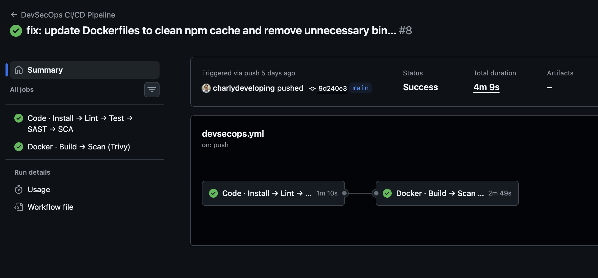
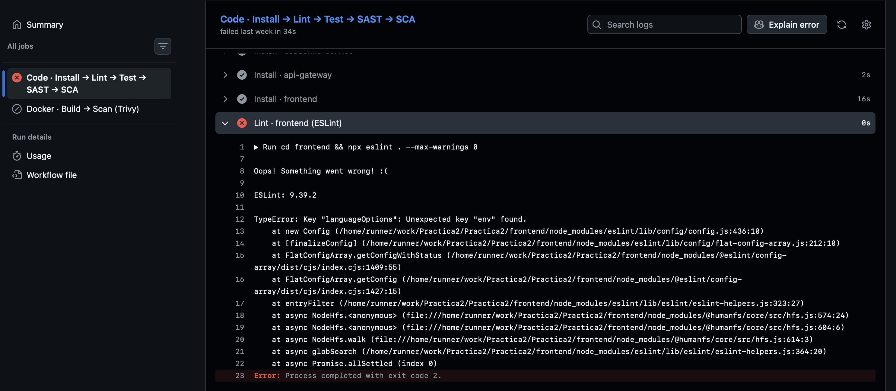
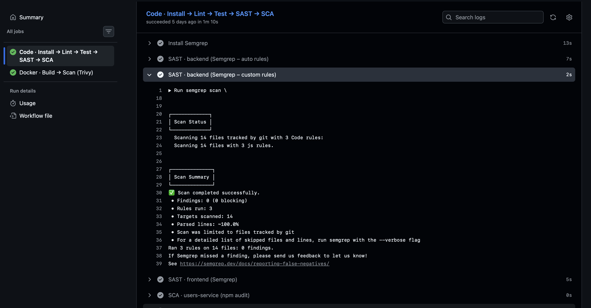
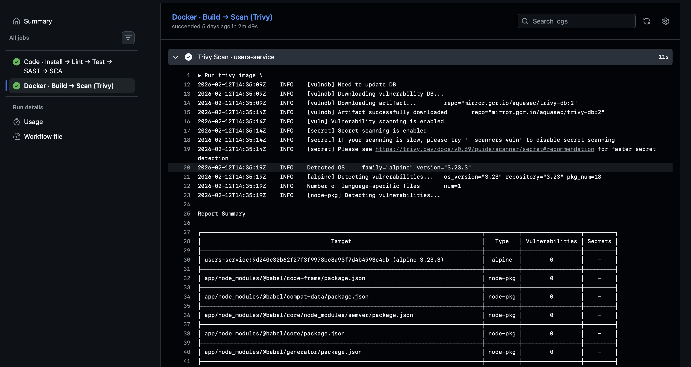

# Justificación Técnica del Pipeline DevSecOps

## 1. Introducción

El presente documento justifica técnicamente el diseño e implementación del pipeline CI/CD con enfoque DevSecOps aplicado al repositorio base de la Práctica 2, el mismo que se generó un fork.

🔗 [https://github.com/charlydeveloping/Practica2](https://github.com/charlydeveloping/Practica2)

El objetivo del pipeline no es únicamente automatizar la integración continua, sino actuar como un sistema de control de calidad y seguridad, donde el código solo puede avanzar si cumple criterios funcionales y de seguridad definidos previamente.

Se adopta el enfoque **Shift-Left Security**, incorporando controles de seguridad desde las primeras etapas del ciclo de desarrollo y no únicamente al momento del despliegue.

---

## 2. Estructura general del pipeline

El pipeline está dividido en dos grandes bloques:

1. **Code Quality & Security**
2. **Docker Build & Container Security**

La secuencia lógica implementada es:

```
Install → Lint → Test → SAST → SCA → Build → Container Scan → Smoke Test
```

Esta estructura responde al modelo DevSecOps donde seguridad y calidad están integradas en cada fase del proceso.

### Evidencia: Pipeline ejecutado exitosamente



---

## 3. Justificación por etapa

### 3.1 Instalación Reproducible – `npm ci`

| Aspecto | Detalle |
|---|---|
| **Herramienta utilizada** | `npm ci` |
| **Fase DevSecOps** | Integración Continua (CI) |
| **Riesgo mitigado** | Inconsistencias entre `package.json` y `package-lock.json`, dependencias no determinísticas, problemas de reproducibilidad |

**Justificación técnica:**
Se utiliza `npm ci` en lugar de `npm install` porque garantiza una instalación determinística basada estrictamente en el archivo lock. Si el lock no coincide con el `package.json`, el pipeline falla automáticamente, evitando que código inconsistente avance hacia etapas posteriores. Sin este control, podrían introducirse errores difíciles de replicar en producción.

---

### 3.2 Análisis de Calidad – ESLint

| Aspecto | Detalle |
|---|---|
| **Herramienta utilizada** | ESLint con `--max-warnings 0` |
| **Fase DevSecOps** | Code Quality |
| **Riesgo mitigado** | Malas prácticas, errores sintácticos, código propenso a fallos |

**Justificación técnica:**
ESLint actúa como una primera barrera de calidad. Al configurarlo como gate real, el pipeline falla si existen errores o advertencias. Aunque el sistema pueda funcionar, código con malas prácticas aumenta la probabilidad de bugs y vulnerabilidades futuras.

#### Evidencia: ESLint como gate de seguridad (fallo detectado)



> La imagen muestra cómo el pipeline falla al detectar un error de configuración en ESLint (`TypeError: Key "languageOptions": Unexpected key "env" found.`), demostrando que el gate de calidad impide que código con problemas avance.

---

### 3.3 Testing Automático – Jest

| Aspecto | Detalle |
|---|---|
| **Herramienta utilizada** | Jest |
| **Fase DevSecOps** | Continuous Testing |
| **Riesgo mitigado** | Regresiones, errores funcionales, cambios que rompen el sistema |

**Justificación técnica:**
Los tests automatizados verifican que el comportamiento del sistema se mantiene estable tras cada cambio. El pipeline falla si cualquier test falla, garantizando que solo código funcionalmente correcto continúe hacia etapas de seguridad y construcción de contenedores. Sin testing automático, el pipeline perdería su capacidad de control funcional.

---

### 3.4 Seguridad del Código (SAST) – Semgrep

| Aspecto | Detalle |
|---|---|
| **Herramienta utilizada** | Semgrep (`--severity ERROR --error`) + reglas automáticas y personalizadas |
| **Fase DevSecOps** | Static Application Security Testing (SAST) |
| **Riesgo mitigado** | Inyecciones, uso inseguro de APIs, patrones vulnerables en el código fuente |

**Justificación técnica:**
Semgrep analiza el código estático antes de su ejecución, detectando patrones de vulnerabilidad conocidos. Se configura como gate real, lo que significa que el pipeline falla ante hallazgos críticos. La ventaja del SAST es que permite detectar vulnerabilidades en etapas tempranas, reduciendo costos de remediación.

#### Evidencia: Semgrep – escaneo con reglas personalizadas



> La imagen muestra el resultado del escaneo SAST con Semgrep utilizando 3 reglas personalizadas sobre 14 archivos, con 0 hallazgos, lo que confirma que el código cumple con los estándares de seguridad definidos.

---

### 3.5 Seguridad de Dependencias (SCA) – npm audit

| Aspecto | Detalle |
|---|---|
| **Herramienta utilizada** | `npm audit --audit-level=critical` |
| **Fase DevSecOps** | Software Composition Analysis (SCA) |
| **Riesgo mitigado** | CVEs en librerías externas, uso de paquetes vulnerables |

**Justificación técnica:**
Muchas vulnerabilidades modernas no están en el código propio, sino en dependencias externas. `npm audit` detecta vulnerabilidades conocidas en el árbol de dependencias y bloquea el pipeline si existen riesgos críticos. Sin SCA, el sistema podría desplegar código aparentemente correcto pero vulnerable por sus librerías.

---

### 3.6 Build de Contenedores – Docker

| Aspecto | Detalle |
|---|---|
| **Herramienta utilizada** | Docker Buildx, versionado con SHA del commit |
| **Fase DevSecOps** | Continuous Delivery |
| **Riesgo mitigado** | Despliegues no versionados, falta de trazabilidad |

**Justificación técnica:**
Las imágenes se versionan utilizando el SHA del commit, garantizando trazabilidad completa entre código fuente e imagen generada. Esto permite reproducibilidad y auditoría posterior en caso de incidentes.

---

### 3.7 Seguridad de Contenedores – Trivy

| Aspecto | Detalle |
|---|---|
| **Herramienta utilizada** | Trivy (`--severity HIGH,CRITICAL --exit-code 1`) |
| **Fase DevSecOps** | Container Security |
| **Riesgo mitigado** | Vulnerabilidades en sistema base, CVEs en librerías del sistema operativo, dependencias internas del contenedor |

**Justificación técnica:**
Aunque el código esté libre de vulnerabilidades, la imagen Docker puede contener fallos en el sistema base (por ejemplo, Node, Alpine, Debian). Trivy escanea la imagen completa y bloquea el pipeline ante vulnerabilidades críticas o altas. Esto extiende la seguridad más allá del código fuente.

#### Evidencia: Trivy – escaneo de imagen de contenedor



> La imagen muestra el escaneo de Trivy sobre la imagen `users-service` basada en Alpine 3.23.3, reportando 0 vulnerabilidades en el sistema base y en las dependencias de Node.js.

---

### 3.8 Smoke Test

| Aspecto | Detalle |
|---|---|
| **Herramienta utilizada** | Docker Compose, `curl --fail` |
| **Fase DevSecOps** | Post-Build Validation |
| **Riesgo mitigado** | Fallos de integración entre microservicios, problemas de configuración |

**Justificación técnica:**
El smoke test valida que la aplicación levanta correctamente en un entorno contenedorizado y responde al endpoint `/health`. Esto asegura que el sistema no solo compila y pasa tests unitarios, sino que funciona integrado.

---

## 4. Enfoque DevSecOps Implementado

El pipeline implementa un modelo de **gates de seguridad y calidad**, donde cada etapa puede detener la ejecución.

El código solo avanza si cumple:

- ✅ Calidad de código
- ✅ Correcto funcionamiento
- ✅ Ausencia de vulnerabilidades críticas en código
- ✅ Ausencia de vulnerabilidades críticas en dependencias
- ✅ Ausencia de vulnerabilidades críticas en contenedores

Esto convierte el pipeline en un **mecanismo automático de control**.

---

## 5. Conclusión

El pipeline diseñado no se limita a automatizar tareas, sino que implementa un **enfoque DevSecOps integral**, integrando calidad, testing y seguridad como requisitos obligatorios antes del despliegue.

Cada herramienta fue seleccionada estratégicamente según la fase del ciclo DevSecOps y el tipo de riesgo que mitiga.

El resultado es un sistema que:

- ✅ Es **reproducible**
- ✅ Es **trazable**
- ✅ Es **seguro**
- ✅ Es **validado funcionalmente**
- ✅ **Impide que código inseguro avance**

---

## Arquitectura del Sistema

```
[ Front-end ]
     |
     | Login / JWT
     v
[ users-service ]
     |
     | JWT
     v
[ api-gateway ]
     |
     v
[ academic-service ]
```

---

## Comandos útiles

### Docker Compose

```bash
docker-compose down
docker-compose up --build
```

### Kubernetes

```bash
# Desplegar
kubectl apply -f k8s/namespace.yaml
kubectl apply -f k8s/users-service/
kubectl apply -f k8s/academic-service/
kubectl apply -f k8s/api-gateway/
kubectl apply -f k8s/frontend/

# Verificar
kubectl get pods
kubectl get services

# Construir imágenes dentro de Minikube
minikube start
eval $(minikube docker-env)

docker build -t users-service backend/users-service
docker build -t academic-service backend/academic-service
docker build -t api-gateway backend/api-gateway
docker build -t frontend frontend

kubectl apply -f k8s/
```